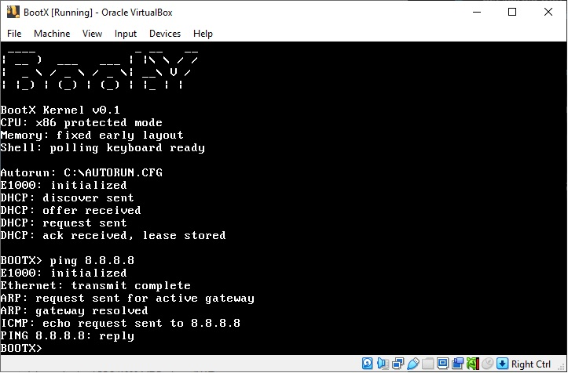

# BootX



BootX is a small educational operating system project. The first target is a BIOS-bootable x86 image that prints from a 512-byte boot sector, then grows into a protected-mode kernel and command shell.

Current implementation target:

```text
BIOS -> 512-byte boot sector -> stage2 loader -> text output
```

Initial UEFI target:

```text
UEFI -> \EFI\BOOT\BOOTX64.EFI -> UEFI console/network DHCP status
```

Longer-term target:

```text
BIOS / UEFI -> BootX bootloader -> BootX kernel -> BootX shell -> apps
```

## Build

Required tools for the first phase:

- NASM
- GNU Make or a compatible `make`
- QEMU for running the image

On Ubuntu/WSL:

```bash
./scripts/setup-dev.sh
```

or manually:

```bash
sudo apt-get update
sudo apt-get install -y nasm make qemu-system-x86
```

Build the boot image:

```bash
make all
```

Build the UEFI removable-media loader:

```bash
make uefi
```

Verify the image layout:

```bash
make verify
```

Run it in QEMU:

```bash
make run
```

Run with the planned QEMU network device:

```bash
make run-net
```

Write `build/bootx.img` to a USB flash drive with Rufus on Windows:

- Build the image first with `make all`.
- Open Rufus and select your USB flash drive.
- Choose `build\bootx.img` as the boot image.
- Use `MBR` partition scheme and `BIOS or UEFI` target system.
- If prompted, write the image in `DD Image` mode.
- Confirm the selected USB device before starting, as Rufus will overwrite it.

For VirtualBox networking, use the `Intel PRO/1000 MT Desktop (82540EM)`
adapter type and attach `build/bootx.vdi` as a hard disk. BootX does not include
a PCnet-FAST III driver.

On Windows PowerShell, the helper scripts can be run directly:

```powershell
.\scripts\build.ps1
.\scripts\run-qemu.ps1
.\scripts\build-uefi.ps1
```

The PowerShell build path includes a Phase 1 fallback byte emitter for machines without NASM. The normal development path is WSL/Linux with NASM and QEMU installed.
The UEFI path requires NASM and an OVMF firmware image. Set `OVMF_CODE` or pass `-OvmfCode` when using `.\scripts\run-qemu-uefi.ps1`. The UEFI QEMU helper attaches an `e1000` NIC for firmware `EFI_SIMPLE_NETWORK_PROTOCOL` testing.

## Project Files

- `bootx-blueprint-plan.md` contains the full blueprint.
- `progress-plan.md` tracks done and remaining work.
- `bootloader/stage1/boot.asm` contains the current BIOS boot sector.
