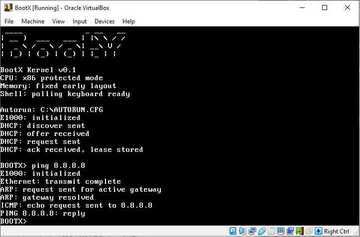

# BootX



BootX is a small educational operating system project. The first target is a BIOS-bootable x86 image that prints from a 512-byte boot sector, then grows into a protected-mode kernel and command shell.

BootX also contains a Human + AI companion research program centered on truth, self-correction, trust, human agency, protection, and long-term resilience. The professional study framework begins at [docs/README.md](docs/README.md).

## Project Constitution and Stewardship

- [CHARTER.md](CHARTER.md) — why BootX exists and its protected commitments
- [GOVERNANCE.md](GOVERNANCE.md) — how decisions, amendments, dissent, and releases are governed
- [SUCCESSION.md](SUCCESSION.md) — how stewardship, security, and operations continue beyond any individual or provider
- [LICENSE](LICENSE) — BootX Common Good Ethical Use License 1.0
- [LICENSING.md](LICENSING.md) — plain-language licensing policy, AI DNA conditions, and distribution guidance
- [DISCLAIMER.md](DISCLAIMER.md) — research limitations, responsibility, and non-advice boundaries
- [PROGRESS.md](PROGRESS.md) — completed work, open gates, OS readiness, and future inheritance priorities

BootX supports **any conforming AI agent**, not unrestricted use of any agent. Compatibility requires published capability, security, privacy, safety, provenance, and human-control requirements.

BootX is royalty-free for permitted common-good uses under a custom ethical source-available license. Harmful uses are prohibited, and public AI companion or High-Impact deployments require documented AI DNA assurance. Because the license restricts fields of use, it is not represented as OSI-approved open source or standard free software.

## Repository Layout

```text
bootx/
├── README.md, CHARTER.md, GOVERNANCE.md, SUCCESSION.md
├── LICENSE, LICENSING.md, DISCLAIMER.md, PROGRESS.md
├── artifacts/
│   ├── boot/                 compiled IMG, ISO, and VDI artifacts
│   └── media/                screenshots and visual evidence
└── docs/
    ├── README.md             documentation portal
    ├── guides/               installation and operating guidance
    ├── handbook/             professional Human + AI R&D framework
    └── research/             original studies grouped by subject
```

## Repository State

This checkout contains prebuilt BIOS/ISO/VDI artifacts and research documents. The source code, build scripts, and historical blueprint files referenced below are not present in the current repository, so the supplied binaries cannot presently be reproduced or source-audited from this checkout. Treat them as experimental educational artifacts. See the [repository evidence audit](docs/handbook/01-repository-evidence-audit.md) and [current progress gate](PROGRESS.md) for verified status and restoration priorities.

## Human + AI Research Handbook

- [Documentation portal](docs/README.md)
- [Professional handbook](docs/handbook/README.md)
- [Foundation and scope](docs/handbook/00-foundation-and-scope.md)
- [Logic and epistemology](docs/handbook/02-logic-and-epistemology.md)
- [Mathematics and measurement](docs/handbook/03-mathematics-and-measurement.md)
- [Ethics, rights, and governance](docs/handbook/04-ethics-rights-and-governance.md)
- [AI DNA operational specification](docs/handbook/05-ai-dna-specification.md)
- [Companion system architecture](docs/handbook/06-companion-system-architecture.md)
- [Research and implementation roadmap](docs/handbook/07-research-and-implementation-roadmap.md)
- [Professional curriculum and assessment](docs/handbook/08-curriculum-and-assessment.md)
- [Safety case and risk register](docs/handbook/09-safety-case-and-risk-register.md)
- [Glossary and reusable templates](docs/handbook/10-glossary-and-templates.md)
- [Standards and authoritative reading map](docs/handbook/11-standards-and-reading-map.md)

Additional collections:

- [Research library](docs/research/README.md)
- [Installation guide](docs/guides/install-guide.md)
- [Compiled artifact inventory](artifacts/README.md)

Current implementation target:

```text
BIOS -> 512-byte boot sector -> stage2 loader -> text output
```

Initial UEFI target:

```text
UEFI -> \EFI\BOOT\BOOTX64.EFI -> UEFI console/network DHCP status
```

Longer-term target:

```text
BIOS / UEFI -> BootX bootloader -> BootX kernel -> BootX shell -> apps
```

## Build

Required tools for the first phase:

- NASM
- GNU Make or a compatible `make`
- QEMU for running the image

On Ubuntu/WSL:

```bash
./scripts/setup-dev.sh
```

or manually:

```bash
sudo apt-get update
sudo apt-get install -y nasm make qemu-system-x86
```

Build the boot image:

```bash
make all
```

Build the UEFI removable-media loader:

```bash
make uefi
```

Verify the image layout:

```bash
make verify
```

Run it in QEMU:

```bash
make run
```

Run with the planned QEMU network device:

```bash
make run-net
```

Write `build/bootx.img` to a USB flash drive with Rufus on Windows:

- Build the image first with `make all`.
- Open Rufus and select your USB flash drive.
- Choose `build\bootx.img` as the boot image.
- Use `MBR` partition scheme and `BIOS or UEFI` target system.
- If prompted, write the image in `DD Image` mode.
- Confirm the selected USB device before starting, as Rufus will overwrite it.

For VirtualBox networking, use the `Intel PRO/1000 MT Desktop (82540EM)`
adapter type and attach `build/bootx.vdi` as a hard disk. BootX does not include
a PCnet-FAST III driver.

On Windows PowerShell, the helper scripts can be run directly:

```powershell
.\scripts\build.ps1
.\scripts\run-qemu.ps1
.\scripts\build-uefi.ps1
```

The PowerShell build path includes a Phase 1 fallback byte emitter for machines without NASM. The normal development path is WSL/Linux with NASM and QEMU installed.
The UEFI path requires NASM and an OVMF firmware image. Set `OVMF_CODE` or pass `-OvmfCode` when using `.\scripts\run-qemu-uefi.ps1`. The UEFI QEMU helper attaches an `e1000` NIC for firmware `EFI_SIMPLE_NETWORK_PROTOCOL` testing.

## Historically Referenced Files Not Present in This Checkout

- `bootx-blueprint-plan.md` was described as containing the full blueprint.
- `bootloader/stage1/boot.asm` was described as containing the BIOS boot sector source.

The authoritative current progress record is [PROGRESS.md](PROGRESS.md).
